# CommitEd System - Sequence Diagrams

// TODO: Create an auth verification sequence diagrams to call in the other diagrams

## 0. Auth Verification
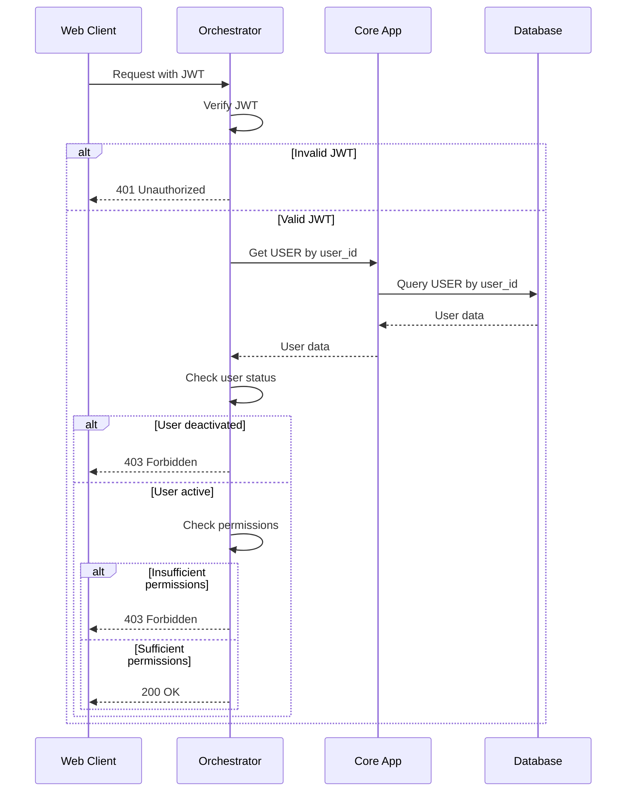
```mermaid
sequenceDiagram
    participant WC as Web Client
    participant O as Orchestrator
    participant CA as Core App
    participant DB as Database

    WC->>O: Request with JWT
    O->>O: Verify JWT
    alt Invalid JWT
        O-->>WC: 401 Unauthorized
    else Valid JWT
        O->>CA: Get USER by user_id
        CA->>DB: Query USER by user_id
        DB-->>CA: User data
        CA-->>O: User data
        O->>O: Check user status
        alt User deactivated
            O-->>WC: 403 Forbidden
        else User active
            O->>O: Check permissions
            alt Insufficient permissions
                O-->>WC: 403 Forbidden
            else Sufficient permissions
                O-->>WC: 200 OK
            end
        end
    end
```

## 1. User Authentication & Registration

### 1.1 User Login
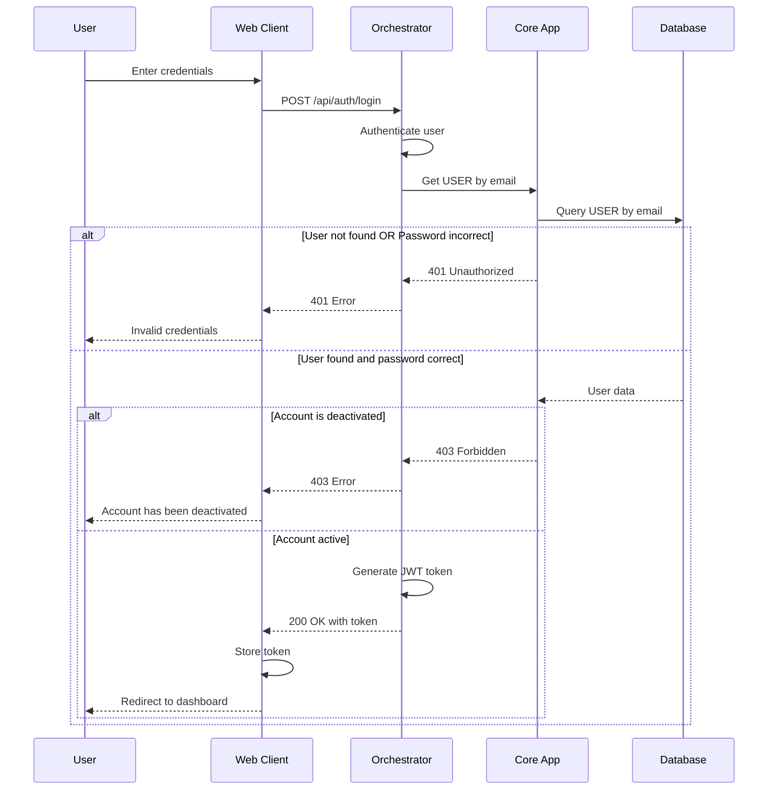
```mermaid
sequenceDiagram
    participant U as User
    participant WC as Web Client
    participant O as Orchestrator
    participant CA as Core App
    participant DB as Database

    U->>WC: Enter credentials
    WC->>O: POST /api/auth/login
    O->>O: Authenticate user
    O->>CA: Get USER by email
    CA->>DB: Query USER by email
    alt User not found OR Password incorrect
        CA-->>O: 401 Unauthorized
        O-->>WC: 401 Error
        WC-->>U: Invalid credentials
    else User found and password correct
        DB-->>CA: User data
        alt Account is deactivated
            CA-->>O: 403 Forbidden
            O-->>WC: 403 Error
            WC-->>U: Account has been deactivated
        else Account active
            O->>O: Generate JWT token
            O-->>WC: 200 OK with token
            WC->>WC: Store token
            WC-->>U: Redirect to dashboard
        end
    end
```

### 1.2 Guest User Registration
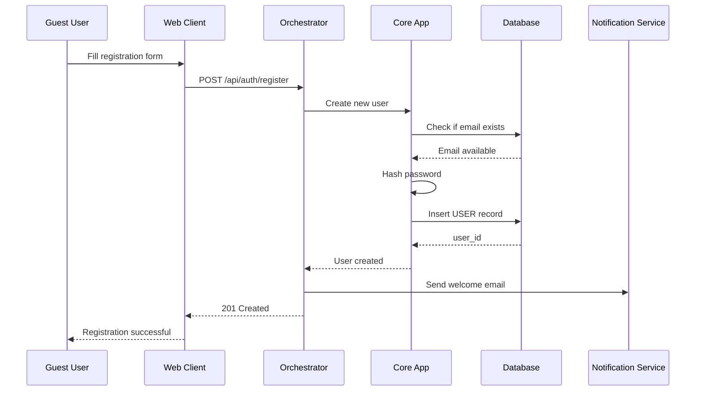
```mermaid
sequenceDiagram
    participant G as Guest User
    participant WC as Web Client
    participant O as Orchestrator
    participant CA as Core App
    participant DB as Database
    participant NS as Notification Service

    G->>WC: Fill registration form
    WC->>O: POST /api/auth/register
    O->>CA: Create new user
    CA->>DB: Check if email exists
    DB-->>CA: Email available
    CA->>CA: Hash password
    CA->>DB: Insert USER record
    DB-->>CA: user_id
    CA-->>O: User created
    O->>NS: Send welcome email
    O-->>WC: 201 Created
    WC-->>G: Registration successful
```

---

## 2. Course Management (Professor)

### 2.1 Create a Course
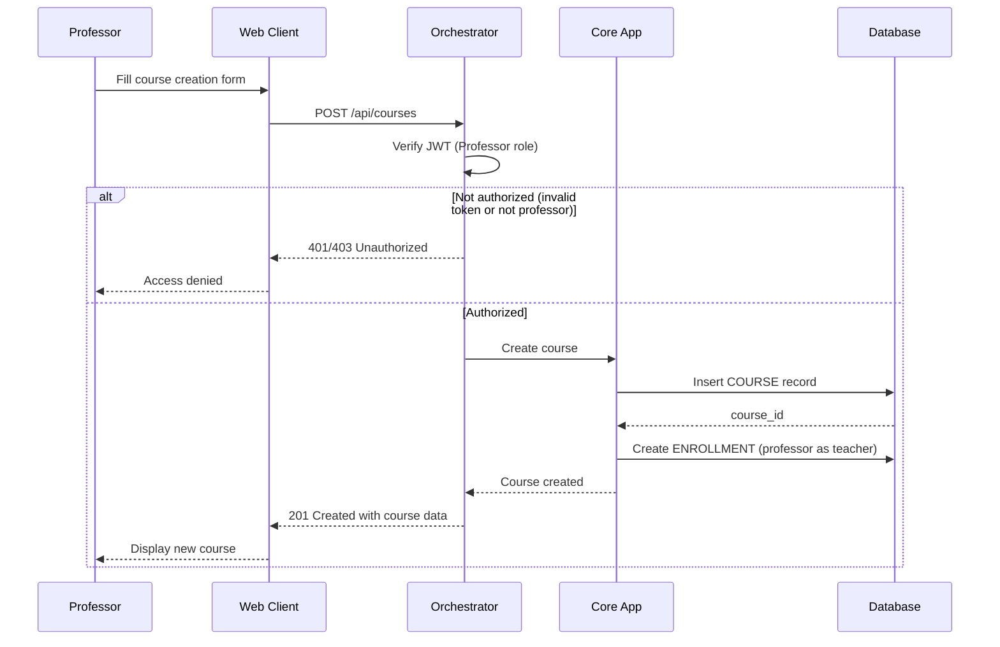
```mermaid
sequenceDiagram
    participant P as Professor
    participant WC as Web Client
    participant O as Orchestrator
    participant CA as Core App
    participant DB as Database

    P->>WC: Fill course creation form
    WC->>O: POST /api/courses
    O->>O: Verify JWT (Professor role)
    alt Not authorized (invalid token or not professor)
        O-->>WC: 401/403 Unauthorized
        WC-->>P: Access denied
    else Authorized
        O->>CA: Create course
        CA->>DB: Insert COURSE record
        DB-->>CA: course_id
        CA->>DB: Create ENROLLMENT (professor as teacher)
        CA-->>O: Course created
        O-->>WC: 201 Created with course data
        WC-->>P: Display new course
    end
```

### 2.2 Edit a Course
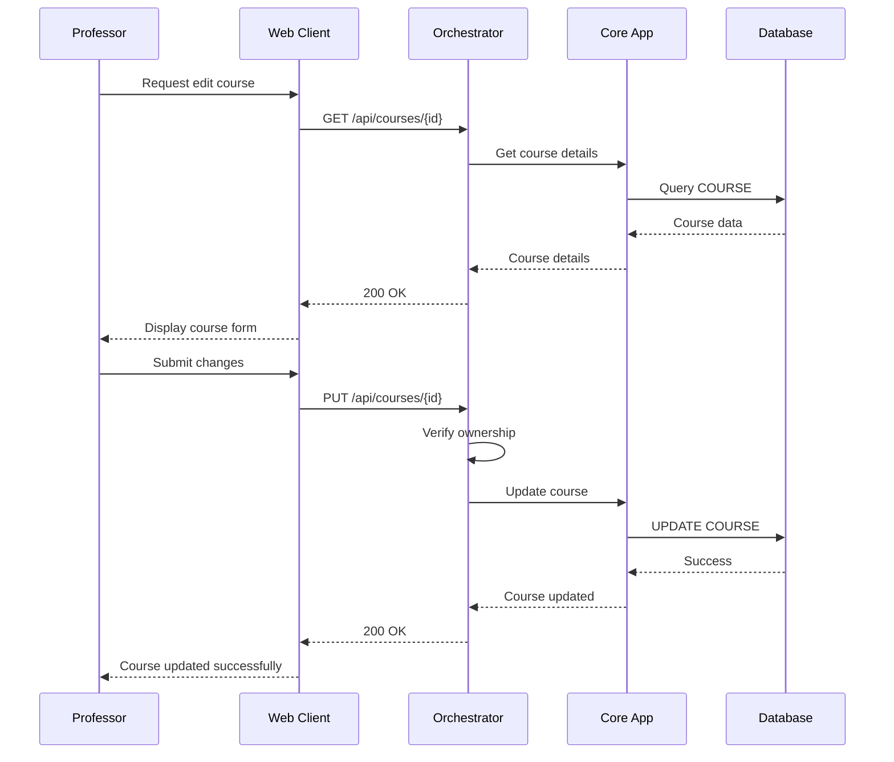
```mermaid
sequenceDiagram
    participant P as Professor
    participant WC as Web Client
    participant O as Orchestrator
    participant CA as Core App
    participant DB as Database

    P->>WC: Request edit course
    WC->>O: GET /api/courses/{id}
    O->>CA: Get course details
    CA->>DB: Query COURSE
    DB-->>CA: Course data
    CA-->>O: Course details
    O-->>WC: 200 OK
    WC-->>P: Display course form
    
    P->>WC: Submit changes
    WC->>O: PUT /api/courses/{id}
    O->>O: Verify ownership
    O->>CA: Update course
    CA->>DB: UPDATE COURSE
    DB-->>CA: Success
    CA-->>O: Course updated
    O-->>WC: 200 OK
    WC-->>P: Course updated successfully
```

### 2.3 Mark Course as Done
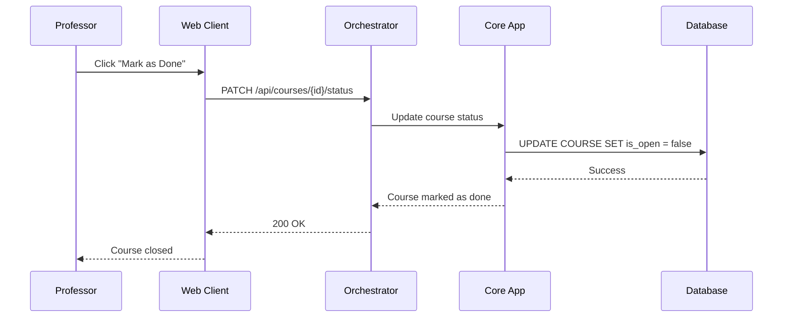
```mermaid
sequenceDiagram
    participant P as Professor
    participant WC as Web Client
    participant O as Orchestrator
    participant CA as Core App
    participant DB as Database

    P->>WC: Click "Mark as Done"
    WC->>O: PATCH /api/courses/{id}/status
    O->>CA: Update course status
    CA->>DB: UPDATE COURSE SET is_open = false
    DB-->>CA: Success
    CA-->>O: Course marked as done
    O-->>WC: 200 OK
    WC-->>P: Course closed
```

### 2.4 Generate Enrollment Code
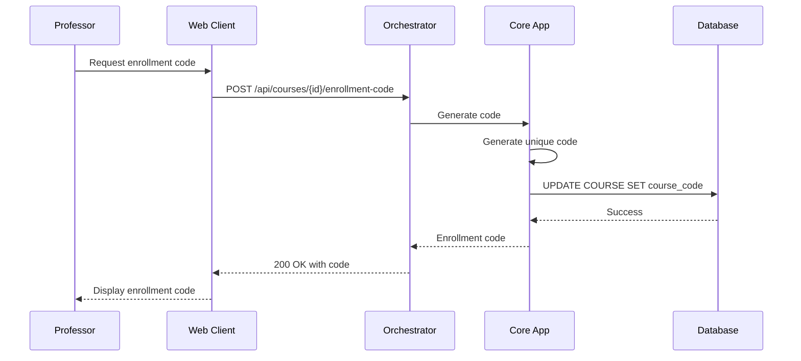
```mermaid
sequenceDiagram
    participant P as Professor
    participant WC as Web Client
    participant O as Orchestrator
    participant CA as Core App
    participant DB as Database

    P->>WC: Request enrollment code
    WC->>O: POST /api/courses/{id}/enrollment-code
    O->>CA: Generate code
    CA->>CA: Generate unique code
    CA->>DB: UPDATE COURSE SET course_code
    DB-->>CA: Success
    CA-->>O: Enrollment code
    O-->>WC: 200 OK with code
    WC-->>P: Display enrollment code
```

---

## 3. Announcement Management

### 3.1 Create Announcement
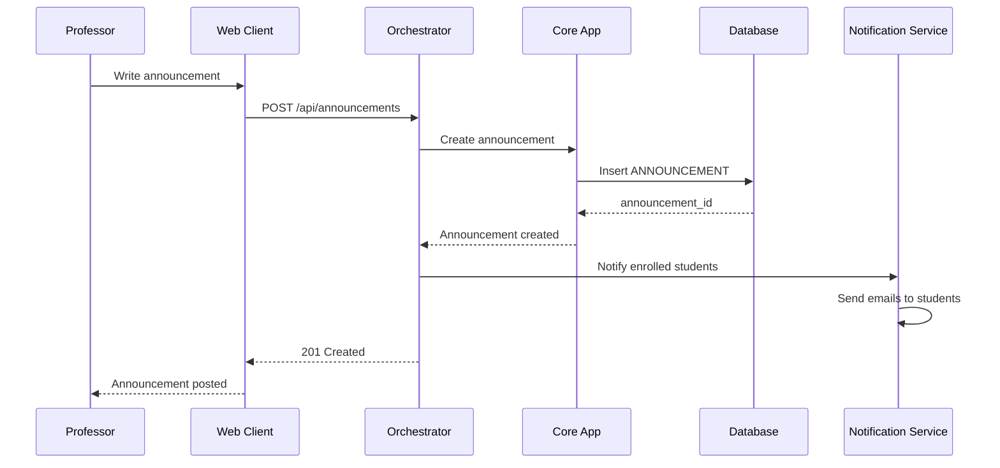
```mermaid
sequenceDiagram
    participant P as Professor
    participant WC as Web Client
    participant O as Orchestrator
    participant CA as Core App
    participant DB as Database
    participant NS as Notification Service

    P->>WC: Write announcement
    WC->>O: POST /api/announcements
    O->>CA: Create announcement
    CA->>DB: Insert ANNOUNCEMENT
    DB-->>CA: announcement_id
    CA-->>O: Announcement created
    O->>NS: Notify enrolled students
    NS->>NS: Send emails to students
    O-->>WC: 201 Created
    WC-->>P: Announcement posted
```

### 3.2 Edit Announcement
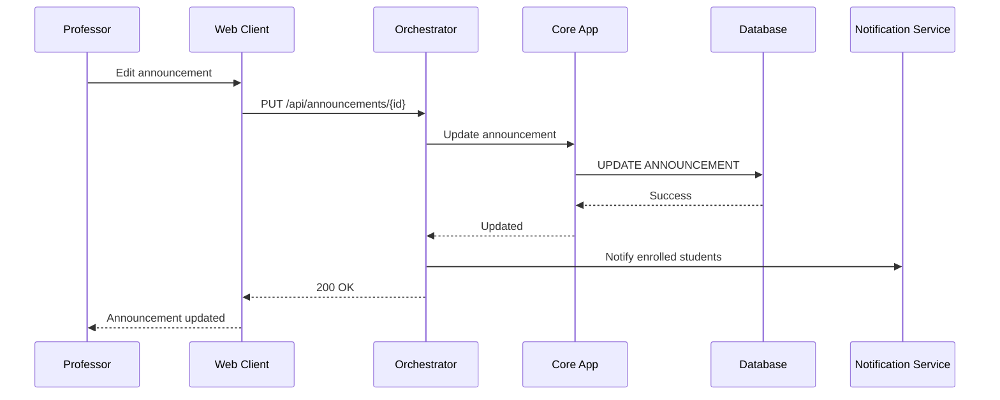
```mermaid
sequenceDiagram
    participant P as Professor
    participant WC as Web Client
    participant O as Orchestrator
    participant CA as Core App
    participant DB as Database
    participant NS as Notification Service

    P->>WC: Edit announcement
    WC->>O: PUT /api/announcements/{id}
    O->>CA: Update announcement
    CA->>DB: UPDATE ANNOUNCEMENT
    DB-->>CA: Success
    CA-->>O: Updated
    O->>NS: Notify enrolled students
    O-->>WC: 200 OK
    WC-->>P: Announcement updated
```

### 3.3 Delete Announcement
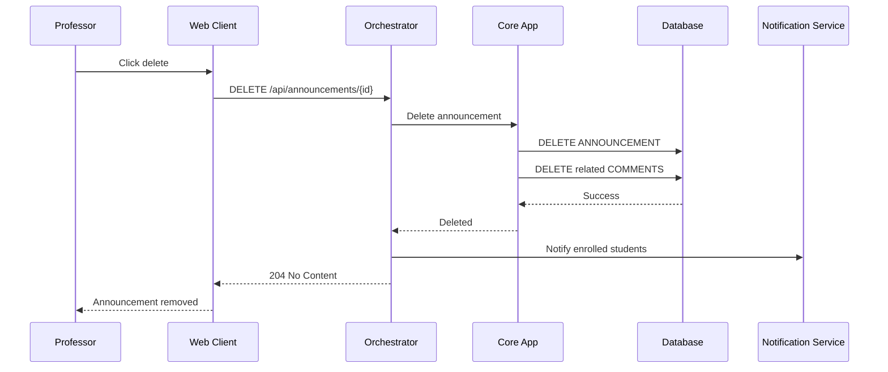
```mermaid
sequenceDiagram
    participant P as Professor
    participant WC as Web Client
    participant O as Orchestrator
    participant CA as Core App
    participant DB as Database
    participant NS as Notification Service

    P->>WC: Click delete
    WC->>O: DELETE /api/announcements/{id}
    O->>CA: Delete announcement
    CA->>DB: DELETE ANNOUNCEMENT
    CA->>DB: DELETE related COMMENTS
    DB-->>CA: Success
    CA-->>O: Deleted
    O->>NS: Notify enrolled students
    O-->>WC: 204 No Content
    WC-->>P: Announcement removed
```

---

## 4. Assignment Management

### 4.1 Create Assignment
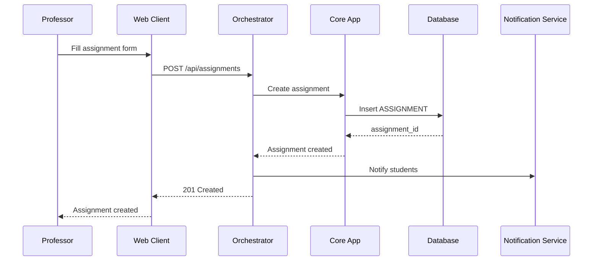
```mermaid
sequenceDiagram
    participant P as Professor
    participant WC as Web Client
    participant O as Orchestrator
    participant CA as Core App
    participant DB as Database
    participant NS as Notification Service

    P->>WC: Fill assignment form
    WC->>O: POST /api/assignments
    O->>CA: Create assignment
    CA->>DB: Insert ASSIGNMENT
    DB-->>CA: assignment_id
    CA-->>O: Assignment created
    O->>NS: Notify students
    O-->>WC: 201 Created
    WC-->>P: Assignment created
```

### 4.2 Edit Assignment
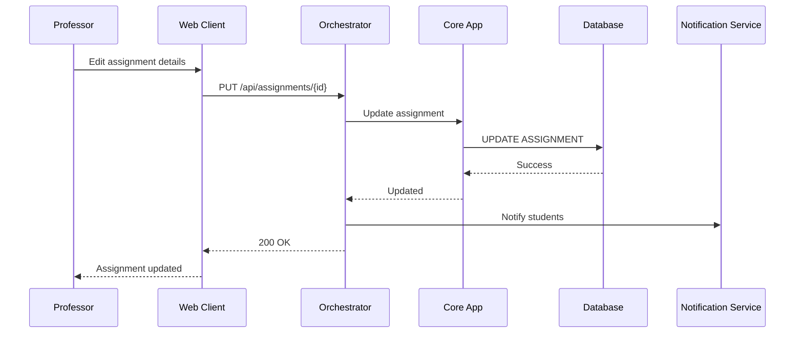
```mermaid
sequenceDiagram
    participant P as Professor
    participant WC as Web Client
    participant O as Orchestrator
    participant CA as Core App
    participant DB as Database
    participant NS as Notification Service

    P->>WC: Edit assignment details
    WC->>O: PUT /api/assignments/{id}
    O->>CA: Update assignment
    CA->>DB: UPDATE ASSIGNMENT
    DB-->>CA: Success
    CA-->>O: Updated
    O->>NS: Notify students
    O-->>WC: 200 OK
    WC-->>P: Assignment updated
```

### 4.3 Delete Assignment
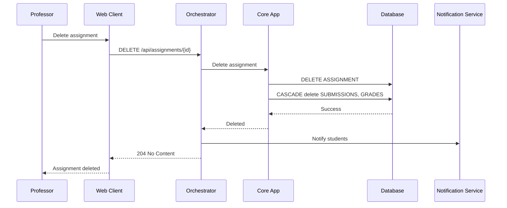
```mermaid
sequenceDiagram
    participant P as Professor
    participant WC as Web Client
    participant O as Orchestrator
    participant CA as Core App
    participant DB as Database
    participant NS as Notification Service

    P->>WC: Delete assignment
    WC->>O: DELETE /api/assignments/{id}
    O->>CA: Delete assignment
    CA->>DB: DELETE ASSIGNMENT
    CA->>DB: CASCADE delete SUBMISSIONS, GRADES
    DB-->>CA: Success
    CA-->>O: Deleted
    O->>NS: Notify students
    O-->>WC: 204 No Content
    WC-->>P: Assignment deleted
```

---

## 5. Assignment Grading

### 5.1 Access Assignment Grades
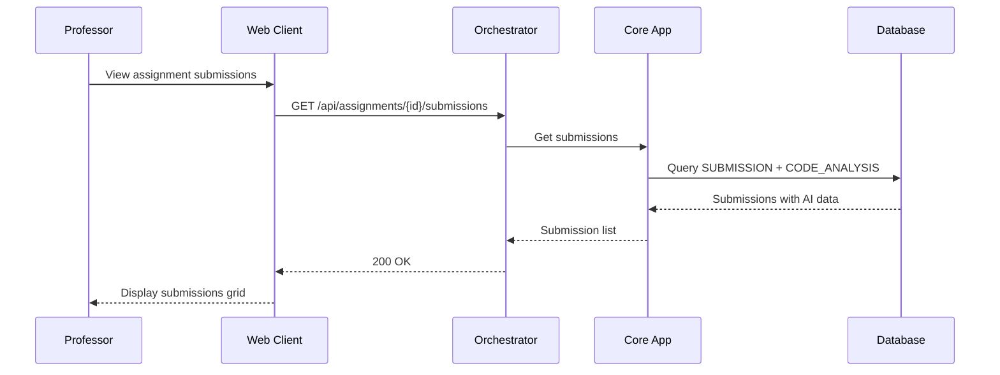
```mermaid
sequenceDiagram
    participant P as Professor
    participant WC as Web Client
    participant O as Orchestrator
    participant CA as Core App
    participant DB as Database

    P->>WC: View assignment submissions
    WC->>O: GET /api/assignments/{id}/submissions
    O->>CA: Get submissions
    CA->>DB: Query SUBMISSION + CODE_ANALYSIS
    DB-->>CA: Submissions with AI data
    CA-->>O: Submission list
    O-->>WC: 200 OK
    WC-->>P: Display submissions grid
```

### 5.2 Update Assignment Grade
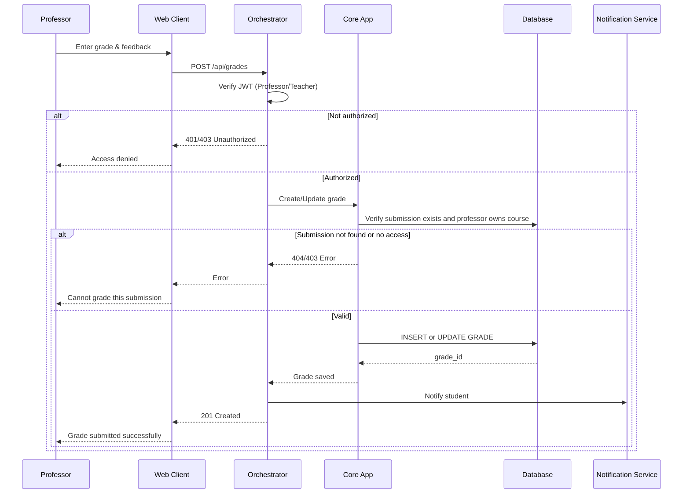
```mermaid
sequenceDiagram
    participant P as Professor
    participant WC as Web Client
    participant O as Orchestrator
    participant CA as Core App
    participant DB as Database
    participant NS as Notification Service

    P->>WC: Enter grade & feedback
    WC->>O: POST /api/grades
    O->>O: Verify JWT (Professor/Teacher)
    alt Not authorized
        O-->>WC: 401/403 Unauthorized
        WC-->>P: Access denied
    else Authorized
        O->>CA: Create/Update grade
        CA->>DB: Verify submission exists and professor owns course
        alt Submission not found or no access
            CA-->>O: 404/403 Error
            O-->>WC: Error
            WC-->>P: Cannot grade this submission
        else Valid
            CA->>DB: INSERT or UPDATE GRADE
            DB-->>CA: grade_id
            CA-->>O: Grade saved
            O->>NS: Notify student
            O-->>WC: 201 Created
            WC-->>P: Grade submitted successfully
        end
    end
```

### 5.3 Unset Assignment Grade
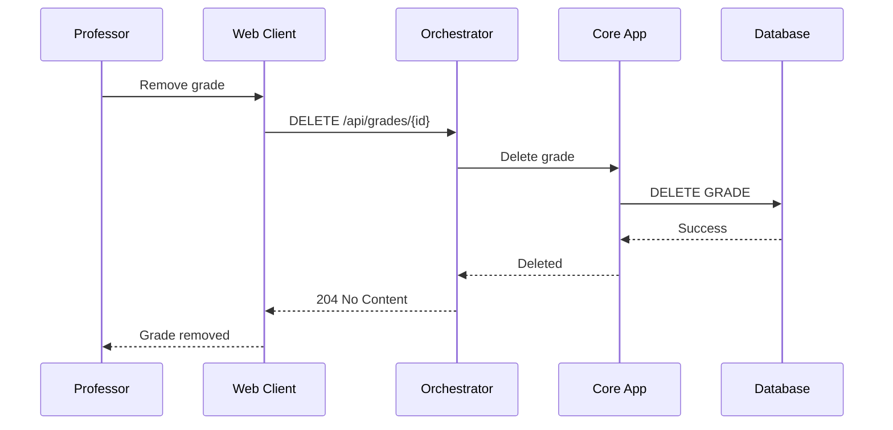
```mermaid
sequenceDiagram
    participant P as Professor
    participant WC as Web Client
    participant O as Orchestrator
    participant CA as Core App
    participant DB as Database

    P->>WC: Remove grade
    WC->>O: DELETE /api/grades/{id}
    O->>CA: Delete grade
    CA->>DB: DELETE GRADE
    DB-->>CA: Success
    CA-->>O: Deleted
    O-->>WC: 204 No Content
    WC-->>P: Grade removed
```

---

## 6. Collaboration Management

### 6.1 Access Course Collaborators list
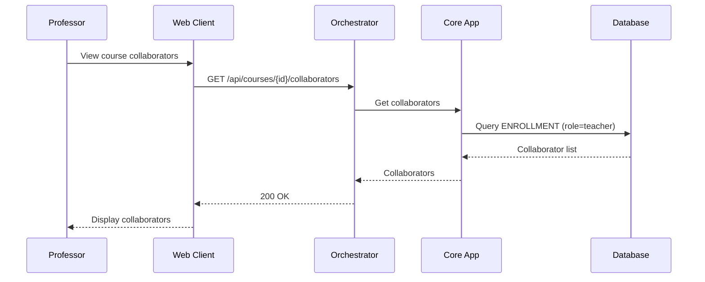
```mermaid
sequenceDiagram
    participant P as Professor
    participant WC as Web Client
    participant O as Orchestrator
    participant CA as Core App
    participant DB as Database

    P->>WC: View course collaborators
    WC->>O: GET /api/courses/{id}/collaborators
    O->>CA: Get collaborators
    CA->>DB: Query ENROLLMENT (role=teacher)
    DB-->>CA: Collaborator list
    CA-->>O: Collaborators
    O-->>WC: 200 OK
    WC-->>P: Display collaborators
```

### 6.2 Remove Collaborator
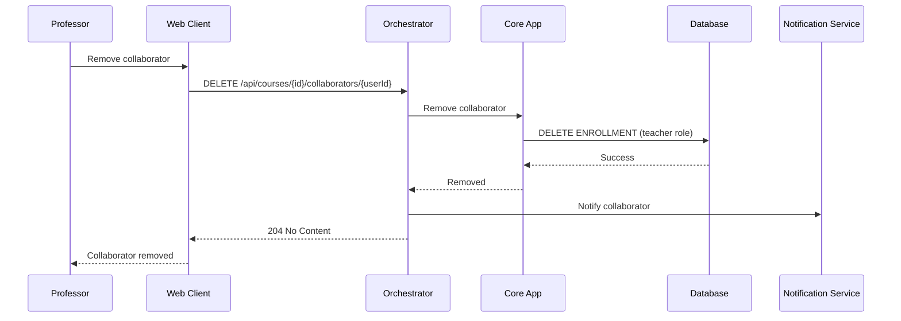
```mermaid
sequenceDiagram
    participant P as Professor
    participant WC as Web Client
    participant O as Orchestrator
    participant CA as Core App
    participant DB as Database
    participant NS as Notification Service

    P->>WC: Remove collaborator
    WC->>O: DELETE /api/courses/{id}/collaborators/{userId}
    O->>CA: Remove collaborator
    CA->>DB: DELETE ENROLLMENT (teacher role)
    DB-->>CA: Success
    CA-->>O: Removed
    O->>NS: Notify collaborator
    O-->>WC: 204 No Content
    WC-->>P: Collaborator removed
```

---

## 7. Student Operations

### 7.1 Join a Course
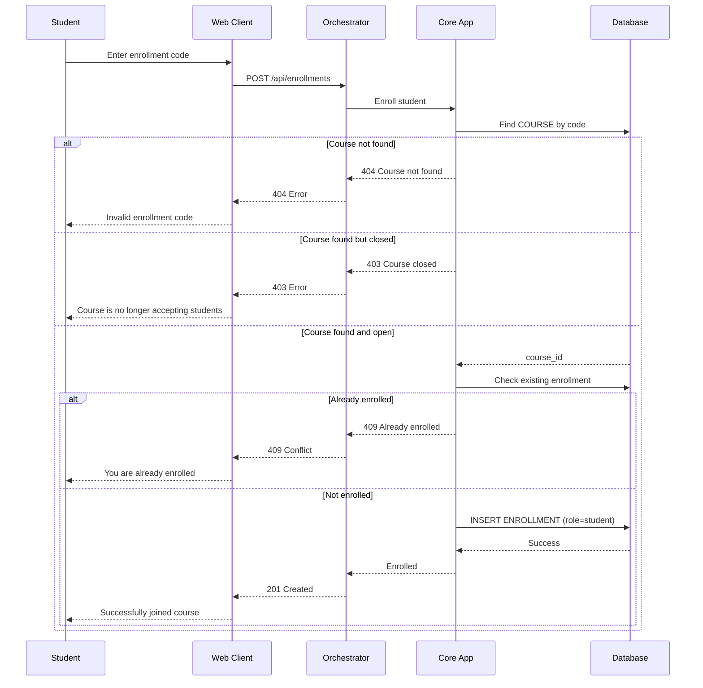
```mermaid
sequenceDiagram
    participant S as Student
    participant WC as Web Client
    participant O as Orchestrator
    participant CA as Core App
    participant DB as Database

    S->>WC: Enter enrollment code
    WC->>O: POST /api/enrollments
    O->>CA: Enroll student
    CA->>DB: Find COURSE by code
    alt Course not found
        CA-->>O: 404 Course not found
        O-->>WC: 404 Error
        WC-->>S: Invalid enrollment code
    else Course found but closed
        CA-->>O: 403 Course closed
        O-->>WC: 403 Error
        WC-->>S: Course is no longer accepting students
    else Course found and open
        DB-->>CA: course_id
        CA->>DB: Check existing enrollment
        alt Already enrolled
            CA-->>O: 409 Already enrolled
            O-->>WC: 409 Conflict
            WC-->>S: You are already enrolled
        else Not enrolled
            CA->>DB: INSERT ENROLLMENT (role=student)
            DB-->>CA: Success
            CA-->>O: Enrolled
            O-->>WC: 201 Created
            WC-->>S: Successfully joined course
        end
    end
```

### 7.2 Access Course Stream Page
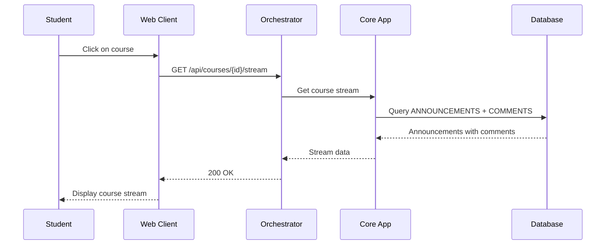
```mermaid
sequenceDiagram
    participant S as Student
    participant WC as Web Client
    participant O as Orchestrator
    participant CA as Core App
    participant DB as Database

    S->>WC: Click on course
    WC->>O: GET /api/courses/{id}/stream
    O->>CA: Get course stream
    CA->>DB: Query ANNOUNCEMENTS + COMMENTS
    DB-->>CA: Announcements with comments
    CA-->>O: Stream data
    O-->>WC: 200 OK
    WC-->>S: Display course stream
```

### 7.3 Access Assignment
```mermaid
sequenceDiagram
    participant S as Student
    participant WC as Web Client
    participant O as Orchestrator
    participant CA as Core App
    participant DB as Database

    S->>WC: View assignment
    WC->>O: GET /api/assignments/{id}
    O->>CA: Get assignment
    CA->>DB: Query ASSIGNMENT
    DB-->>CA: Assignment data
    CA-->>O: Assignment details
    O-->>WC: 200 OK
    WC-->>S: Display assignment
```

### 7.4 Unlock Assignment
```mermaid
sequenceDiagram
    participant S as Student
    participant WC as Web Client
    participant O as Orchestrator
    participant CA as Core App
    participant DB as Database

    S->>WC: Request unlock (if allowed)
    WC->>O: POST /api/submissions/{id}/unlock
    O->>CA: Unlock submission
    CA->>DB: UPDATE SUBMISSION status
    DB-->>CA: Success
    CA-->>O: Unlocked
    O-->>WC: 200 OK
    WC-->>S: Assignment unlocked
```

### 7.5 Access Assignment Report
```mermaid
sequenceDiagram
    participant S as Student
    participant WC as Web Client
    participant O as Orchestrator
    participant CA as Core App
    participant DB as Database

    S->>WC: View my submission
    WC->>O: GET /api/submissions/{id}
    O->>CA: Get submission with analysis
    CA->>DB: Query SUBMISSION + CODE_ANALYSIS + GRADE
    DB-->>CA: Complete data
    CA-->>O: Submission details
    O-->>WC: 200 OK
    WC-->>S: Display report with grade
```

---

## 8. Comment Management

### 8.1 Create Announcement Comment
```mermaid
sequenceDiagram
    participant U as User
    participant WC as Web Client
    participant O as Orchestrator
    participant CA as Core App
    participant DB as Database
    participant NS as Notification Service

    U->>WC: Write comment
    WC->>O: POST /api/comments
    O->>CA: Create comment
    CA->>DB: INSERT COMMENT
    DB-->>CA: comment_id
    CA-->>O: Comment created
    O->>NS: Notify announcement author
    O-->>WC: 201 Created
    WC-->>U: Comment posted
```

### 8.2 Edit Announcement Comment
```mermaid
sequenceDiagram
    participant U as User
    participant WC as Web Client
    participant O as Orchestrator
    participant CA as Core App
    participant DB as Database

    U->>WC: Edit comment
    WC->>O: PUT /api/comments/{id}
    O->>CA: Update comment
    CA->>DB: UPDATE COMMENT
    DB-->>CA: Success
    CA-->>O: Updated
    O-->>WC: 200 OK
    WC-->>U: Comment updated
```

### 8.3 Delete Announcement Comment
```mermaid
sequenceDiagram
    participant U as User
    participant WC as Web Client
    participant O as Orchestrator
    participant CA as Core App
    participant DB as Database

    U->>WC: Delete comment
    WC->>O: DELETE /api/comments/{id}
    O->>CA: Delete comment
    CA->>DB: DELETE COMMENT (cascade replies)
    DB-->>CA: Success
    CA-->>O: Deleted
    O-->>WC: 204 No Content
    WC-->>U: Comment removed
```

### 8.4 Reply to Announcement Comment
```mermaid
sequenceDiagram
    participant U as User
    participant WC as Web Client
    participant O as Orchestrator
    participant CA as Core App
    participant DB as Database
    participant NS as Notification Service

    U->>WC: Write reply
    WC->>O: POST /api/comments (with parent_comment_id)
    O->>CA: Create reply
    CA->>DB: INSERT COMMENT
    DB-->>CA: comment_id
    CA-->>O: Reply created
    O->>NS: Notify parent comment author
    O-->>WC: 201 Created
    WC-->>U: Reply posted
```

---

## 9. Student Submission with AI Analysis

### 9.1 Submit Assignment with GitHub Repo
```mermaid
sequenceDiagram
    participant S as Student
    participant WC as Web Client
    participant O as Orchestrator
    participant CA as Core App
    participant DB as Database
    participant AI as AI Agent
    participant AIC as AI Classification Service
    participant NS as Notification Service

    S->>WC: Submit GitHub URL
    WC->>O: POST /api/submissions
    O->>CA: Create submission
    CA->>DB: INSERT SUBMISSION (status=pending)
    DB-->>CA: submission_id
    CA-->>O: Submission created
    O->>AI: Trigger code analysis
    O-->>WC: 201 Created
    WC-->>S: Submission received
    
    Note over AI: Async Analysis
    AI->>AI: Clone repo in Docker
    AI->>AI: Analyze code & generate metrics
    AI->>O: Request classification
    O->>AIC: Send metrics
    AIC->>AIC: ML model classifies code
    AIC-->>O: Classification result
    O-->>AI: Classification result
    AI->>AI: Compile Typst report to PDF
    AI->>DB: INSERT CODE_ANALYSIS
    AI->>DB: UPDATE SUBMISSION (status=analyzed)
    AI->>O: Analysis complete
    O->>NS: Notify student
```

### 9.2 Analyze Code Base and generate Metric Scores (AI Agent)
```mermaid
sequenceDiagram
    participant O as Orchestrator
    participant AI as AI Agent
    participant Docker as Docker Container
    participant GitHub as GitHub API

    O->>Docker: Create isolated container
    Docker->>GitHub: Clone repository
    GitHub-->>Docker: Repository files
    AI->>Docker: Run code analysis tools
    Docker->>Docker: Parse source files
    Docker->>Docker: Calculate metrics
    Docker->>Docker: Detect patterns
    Docker-->>AI: Analysis results
    AI->>O: Metric Scores
```

### 9.3 Generate Report
```mermaid
sequenceDiagram
    participant O as Orchestrator
    participant AI as AI Agent
    participant TS as Typst Compiler
    participant DB as Database

    O->>AI: Prepare report data
    AI->>TS: Compile report template
    TS->>TS: Generate PDF
    TS-->>AI: report.pdf
    AI->>AI: Upload PDF to storage
    AI->>DB: INSERT CODE_ANALYSIS
    Note over DB: Stores report_pdf_url,<br/>metrics_data, status
    AI-->>O: Report generation complete
```

### 9.4 Classify Student Based on Metric
```mermaid
sequenceDiagram
    participant AIC as AI Classification Service
    participant ML as ML Model
    participant DB as Database

    AIC->>ML: Input: code metrics
    ML->>ML: Feature extraction
    ML->>ML: Apply classification algorithm
    ML->>ML: Generate confidence scores
    ML-->>AIC: Classification + confidence
    AIC->>DB: Store classification result
    AIC->>AIC: Map to grade category
    Note over AIC: Excellent: A<br/>Good: B<br/>Average: C<br/>Below Average: D<br/>Bad: F
```

### 9.5 Provide Feedback Based on Classification
```mermaid
sequenceDiagram
    participant O as Orchestrator
    participant AI as AI Agent
    participant AIC as AI Classification Service
    participant NS as Notification Service

    AIC->>O: Get classification result
    O-->>AI: Classification result
    AI->>AI: Generate feedback text
    AI->>AI: Highlight improvement areas
    AI->>O: Feedback ready
    O->>NS: Send feedback notification
```

---

## 10. User Management (Admin)

### 10.1 Access Users list
```mermaid
sequenceDiagram
    participant A as Admin
    participant WC as Web Client
    participant O as Orchestrator
    participant CA as Core App
    participant DB as Database

    A->>WC: Access user management
    WC->>O: GET /api/users
    O->>CA: Get all users
    CA->>DB: Query USER
    DB-->>CA: User list
    CA-->>O: Users
    O-->>WC: 200 OK
    WC-->>A: Display user list
```

### 10.2 Create New User
```mermaid
sequenceDiagram
    participant A as Admin
    participant WC as Web Client
    participant O as Orchestrator
    participant CA as Core App
    participant DB as Database
    participant NS as Notification Service

    A->>WC: Fill user creation form
    WC->>O: POST /api/users
    O->>CA: Create user
    CA->>DB: INSERT USER
    DB-->>CA: user_id
    CA-->>O: User created
    O->>NS: Send welcome email
    O-->>WC: 201 Created
    WC-->>A: User created successfully
```

### 10.3 Ban User
```mermaid
sequenceDiagram
    participant A as Admin
    participant WC as Web Client
    participant O as Orchestrator
    participant CA as Core App
    participant DB as Database
    participant NS as Notification Service

    A->>WC: Ban user
    WC->>O: PATCH /api/users/{id}/ban
    O->>CA: Deactivate user
    CA->>DB: UPDATE USER SET is_active = false
    DB-->>CA: Success
    CA-->>O: User banned
    O->>NS: Send ban notification
    O-->>WC: 200 OK
    WC-->>A: User banned
```

---

## 11. User Profile Management

### 11.1 Access User Profile
```mermaid
sequenceDiagram
    participant U as User
    participant WC as Web Client
    participant O as Orchestrator
    participant CA as Core App
    participant DB as Database

    U->>WC: View profile
    WC->>O: GET /api/users/{id}
    O->>CA: Get current user
    CA->>DB: Query USER
    DB-->>CA: User data
    CA-->>O: Profile
    O-->>WC: 200 OK
    WC-->>U: Display profile
```

### 11.2 Update User Profile
```mermaid
sequenceDiagram
    participant U as User
    participant WC as Web Client
    participant O as Orchestrator
    participant CA as Core App
    participant DB as Database

    U->>WC: Edit profile
    WC->>O: PUT /api/users/me
    O->>CA: Update profile
    CA->>DB: UPDATE USER
    DB-->>CA: Success
    CA-->>O: Updated
    O-->>WC: 200 OK
    WC-->>U: Profile updated
```

### 11.3 Deactivate User Account
```mermaid
sequenceDiagram
    participant U as User
    participant WC as Web Client
    participant O as Orchestrator
    participant CA as Core App
    participant DB as Database

    U->>WC: Request account deactivation
    WC->>O: DELETE /api/users/{id}
    O->>CA: Deactivate account
    CA->>DB: UPDATE USER SET is_active = false
    DB-->>CA: Success
    CA->>CA: Invalidate sessions
    CA-->>O: Account deactivated
    O-->>WC: 204 No Content
    WC-->>U: Account deactivated, logged out
```

---

## 12. System Access

### 12.1 Access System Dashboard (Admin)
```mermaid
sequenceDiagram
    participant A as Admin
    participant WC as Web Client
    participant O as Orchestrator
    participant CA as Core App
    participant DB as Database

    A->>WC: Navigate to dashboard
    WC->>O: GET /api/admin/dashboard
    O->>O: Verify admin role
    O->>CA: Get dashboard stats
    CA->>DB: Query system statistics
    DB-->>CA: Stats data
    CA-->>O: Dashboard data
    O-->>WC: 200 OK
    WC-->>A: Display admin dashboard
```

### 12.2 Access System Logs
```mermaid
sequenceDiagram
    participant A as Admin
    participant WC as Web Client
    participant O as Orchestrator

    A->>WC: View system logs
    WC->>O: GET /api/admin/logs
    O->>O: Query logs from file
    O-->>WC: 200 OK
    WC-->>A: Display logs
```

### 12.3 Access Landing Page (Authenticated)
```mermaid
sequenceDiagram
    participant U as Authenticated User
    participant WC as Web Client
    participant O as Orchestrator
    participant CA as Core App
    participant DB as Database

    U->>WC: Navigate to home
    WC->>O: GET /api/home
    O->>O: Verify JWT
    O->>CA: Get user's courses
    CA->>DB: Query ENROLLMENT
    DB-->>CA: Enrolled courses
    CA-->>O: Personalized data
    O-->>WC: 200 OK
    WC-->>U: Display dashboard with courses
```

---

## 13. Notification System

### 13.1 Send Email Notification
```mermaid
sequenceDiagram
    participant O as Orchestrator
    participant NS as Notification Service
    participant SMTP as Email Server

    O->>NS: Trigger notification event
    NS->>NS: Build email template
    NS->>SMTP: Send email
    SMTP-->>NS: Delivery status
    NS-->>O: Delivery status
```

---

## Summary

This document contains **comprehensive sequence diagrams** for all major use cases in the CommitEd system:

- **Authentication**: Login, Registration
- **Course Management**: Create, Edit, Mark Done, Generate Code
- **Announcements**: Create, Edit, Delete
- **Assignments**: Create, Edit, Delete, Grade Management
- **Collaborations**: Manage, Remove, Access
- **Student Operations**: Join Course, Submit Assignment, View Reports
- **Comments**: Create, Edit, Delete, Reply
- **AI Analysis**: Code Analysis, Classification, Report Generation, Feedback
- **User Management**: Admin operations, Profile management
- **System**: Dashboard, Logs, Landing Page
- **Notifications**: Email notifications for now.

Each diagram shows the interaction between actors (Professor, Student, Admin, Guest) and the system components (Web Client, Orchestrator, Core App, Database, AI Services, Notification Service).
